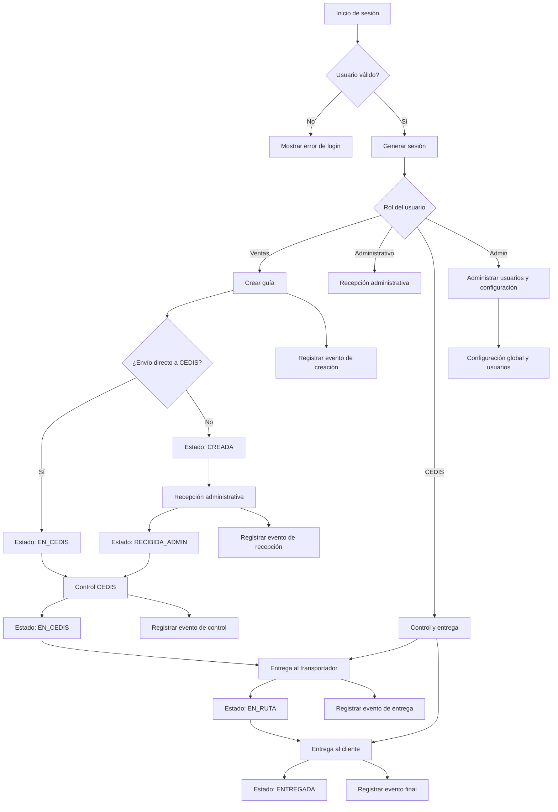
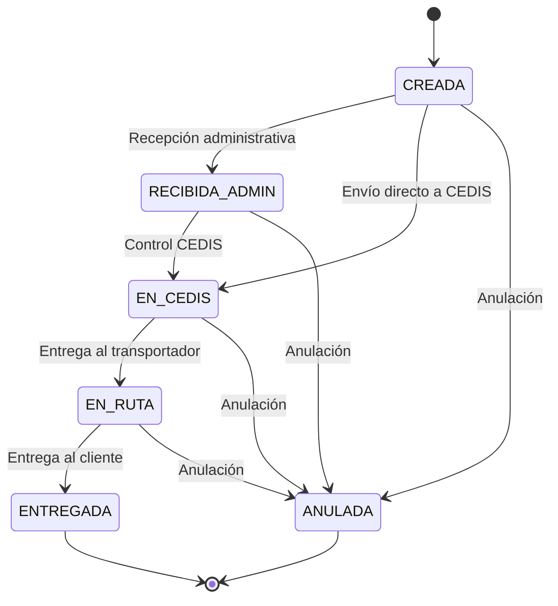

# Documentación funcional del proyecto Guías Coodescor

## 1. Descripción general

Este proyecto es un sistema web local para gestionar actas de entrega digitales de mercancías. Está pensado para funcionar dentro de una red Wi‑Fi local, sin depender de internet ni de servicios externos.

Su propósito principal es registrar guías de transporte, controlar el estado de cada guía, auditar eventos, capturar firmas y fotos, y permitir que distintos roles trabajen según permisos específicos.

El sistema usa:
- Python 3 estándar
- SQLite como base de datos local
- navegador web como interfaz
- almacenamiento local para adjuntos y logs

---

## 2. Objetivo del sistema

El sistema permite:
- Crear guías de transporte
- Registrar información del cliente, ciudad, dirección y documentos
- Definir estados de la guía según el proceso operativo
- Controlar la validación por roles: ventas, administrativo, CEDIS y administrador
- Registrar eventos de cada paso con auditoría
- Guardar firmas y evidencias fotográficas
- Exportar información y mantener trazabilidad

---

## 3. Área de arranque y configuración

### Archivo principal: run_app.py

Este archivo es el punto de entrada del sistema desde la raíz del proyecto. Su función es:
- agregar la ruta del proyecto al sistema de importación
- importar la aplicación principal
- ejecutar la función principal de inicio del sistema

### Archivo: guias_coodescor/app.py

Es el lanzador real de la aplicación. Su flujo es:
1. Configurar logging
2. Inicializar la base de datos
3. Obtener host y puerto de escucha
4. Crear el servidor HTTP
5. Mantener el servicio activo con serve_forever()
6. Capturar señales de cierre como Ctrl+C

### Proceso de arranque

1. Se inicia la aplicación.
2. Se configura el sistema de logs.
3. Se valida e inicializa la base de datos.
4. Se abre el puerto 8000.
5. El servidor queda disponible en:
   - http://localhost:8000
   - http://<IP-del-PC>:8000

### Área de configuración

Archivo: guias_coodescor/config.py

Aquí se centralizan todas las variables clave del sistema:
- rutas de carpetas
- rutas de base de datos
- puerto HTTP
- duración de sesión
- roles válidos
- estados posibles
- valores por defecto
- usuarios iniciales
- configuración general del sistema

Esto hace que toda la lógica esté ordenada y no dispersa en varios archivos.

---

## 4. Área de base de datos

### Archivo: guias_coodescor/database/connection.py

Su función es gestionar las conexiones a SQLite con buenas prácticas:
- activar WAL mode
- activar foreign keys
- usar row_factory para acceder por nombre de columna
- preparar conexiones seguras para lectura y escritura

### Archivo: guias_coodescor/database/models.py

Es la pieza central del esquema de datos. Define:
- tablas de usuarios
- tablas de sesiones
- tabla de guías
- tabla de eventos
- tabla de configuración
- tabla de migraciones

También realiza:
- creación de tablas si no existen
- inserción de usuarios iniciales
- inserción de configuración predeterminada
- aplicación de migraciones SQL
- limpieza de sesiones expiradas

### Proceso de base de datos

1. Se crea la estructura de la base.
2. Si la base está vacía, se insertan usuarios y configuración iniciales.
3. Se aplican migraciones pendientes.
4. Se eliminan sesiones vencidas.
5. La aplicación queda lista para manejar transacciones del negocio.

---

## 5. Área de autenticación y seguridad

### Archivo: guias_coodescor/services/auth_service.py

Este módulo se encarga de:
- login
- logout
- validación de sesión
- creación de usuarios
- control de roles
- gestión de permisos

### Funcionalidades principales

#### Login
- valida si el usuario existe
- valida si la cuenta está activa
- valida la contraseña con hash seguro
- verifica si está bloqueada por demasiados intentos fallidos
- crea una sesión segura para el usuario
- devuelve una cookie con el identificador de sesión

#### Logout
- elimina la sesión activa
- limpia la cookie del navegador

#### Permisos por rol
El sistema tiene roles específicos:
- ventas
- administrativo
- cedis
- admin

Cada acción exige un rol determinado. Esto protege rutas, acciones y operaciones críticas.

### Archivo: guias_coodescor/core/security.py

Aquí se gestionan:
- generación de session IDs
- expiración de sesiones
- bloqueo temporal por intentos fallidos
- control de cookies
- validación segura de credenciales

### Proceso de seguridad

1. El usuario intenta iniciar sesión.
2. El sistema revisa si la cuenta está bloqueada.
3. Verifica identidad y contraseña.
4. Si es válido, crea una sesión con fecha de expiración.
5. El usuario queda autenticado y puede acceder según su rol.
6. Si falla varias veces, la cuenta queda temporalmente bloqueada.

---

## 6. Área de gestión de guías

### Archivo: guias_coodescor/services/guias_service.py

Es el módulo principal de negocio para guías. Aquí se realiza:
- creación de guías
- validación de entrada
- cálculo de consecutivos
- transiciones de estado
- búsqueda de guías
- conteos por estado
- validación de permisos para cada proceso

### Funcionalidades principales

#### Crear guía
Se valida:
- cliente
- ciudad
- dirección
- documentos
- observaciones
- datos prellenados de transporte

Luego se genera un consecutivo y se escribe la guía en la base de datos.

#### Envío directo a CEDIS
Si la guía se marca como envío directo:
- se salta el paso administrativo
- el estado pasa directamente a EN_CEDIS
- se registra un evento especial de auditoría

#### Búsqueda y consulta
Permite buscar guías por:
- número de consecutivo
- nombre del cliente
- estado
- filtro por texto libre

#### Conteo por estado
El sistema puede agrupar guías por estado para ver cuántas están:
- creadas
- recibidas
- en CEDIS
- en ruta
- entregadas
- anuladas

### Proceso lógico de una guía

1. Venta crea la guía.
2. Se genera su consecutivo.
3. Se asigna un estado inicial.
4. Se registra el evento de creación.
5. Si aplica, se marca envío directo a CEDIS.
6. Se avanza por los estados requeridos según el proceso operativo.

---

## 7. Área de eventos y auditoría

### Archivo: guias_coodescor/services/eventos_service.py

Este módulo centraliza la trazabilidad del sistema. Su función es:
- registrar cada cambio relevante en la guía
- guardar firmas y fotos
- actualizar el estado de la guía si corresponde
- almacenar datos JSON con detalles del evento

### ¿Qué se registra?
Se auditan eventos como:
- creación
- recepción administrativa
- envío directo a CEDIS
- control CEDIS
- entrega al transportador
- entrega al cliente
- anulación

### Funcionalidad de adjuntos
Cuando un evento lleva firma o foto:
1. El sistema detecta los datos en formato image data URL
2. Extrae la imagen
3. Guarda el archivo en la carpeta de adjuntos
4. Reemplaza el contenido por la ruta del archivo guardado
5. Guarda la referencia en el evento

Esto evita almacenar archivos enormes directamente en la base de datos y mantiene una estructura ordenada.

### Proceso de auditoría

---

## 7.1 Diagrama de flujo del proceso del sistema

---

## 7.2 Flujo de negocio por estado

---

## 8. Área de interfaz y vistas web

### Carpeta: guias_coodescor/web/views

Aquí están las pantallas y la lógica de presentación de la aplicación.

#### Subáreas
- auth_views.py: inicio de sesión y panel principal
- guias_views.py: creación, listado y detalle de guías
- admin_views.py: administración de usuarios y configuración
- base.py: plantillas, componentes y estructura HTML compartida

### Función general de esta capa
- recibir solicitudes HTTP
- validar sesión
- verificar rol del usuario
- cargar datos del negocio
- renderizar páginas con HTML y datos

### Proceso de la capa web

1. El usuario entra a la app por navegador.
2. El sistema valida si existe sesión activa.
3. Si no hay sesión, redirige al login.
4. Una vez autenticado, el usuario accede a su vista según el rol.
5. El sistema consulta datos de guía, eventos y configuración.
6. Se renderiza la interfaz con información del proceso actual.

---

## 8.1 Pasos por pantalla del usuario

### 1) Pantalla de login

Objetivo:
- autenticarse en el sistema

Pasos:
1. Ingresar usuario y contraseña
2. Validar credenciales
3. Crear sesión con expiración
4. Redirigir al dashboard principal

Resultado:
- usuario autenticado con permisos segun su rol

### 2) Dashboard principal

Objetivo:
- presentar resumen del sistema

Contenido típico:
- total de guías
- guías por estado
- acceso a creación de guías
- acceso a administración
- acceso a historial de eventos

### 3) Pantalla de creación de guía (Ventas)

Objetivo:
- registrar una nueva guía de transporte

Pasos:
1. Ingresar cliente, ciudad y dirección
2. completar documentos y observaciones
3. marcar si es envío directo a CEDIS
4. ingresar información del transportador
5. completar datos de quien recibe en cliente
6. guardar la guía

Resultado:
- guía creada con consecutivo
- estado inicial según flujo
- evento de creación registrado

### 4) Pantalla de recepción administrativa

Objetivo:
- confirmar la recepción de la guía en bodega

Pasos:
1. revisar la guía creada
2. firmar recepción
3. confirmar la llegada física
4. pasar al estado RECIBIDA_ADMIN

Resultado:
- la guía queda en proceso de control CEDIS

### 5) Pantalla de control CEDIS

Objetivo:
- validar bultos y preparar despacho

Pasos:
1. revisar los bultos (cajas, bolsas, cayvas, sobres)
2. confirmar número total
3. verificar transportador y datos del cliente
4. registrar firma o foto de control
5. asignar estado EN_CEDIS o EN_RUTA

Resultado:
- guía lista para entrega al transportador

### 6) Pantalla de entrega al transportador

Objetivo:
- entregar la guía a la operación de ruta

Pasos:
1. validar identificación del transportador
2. confirmar placa, vehículo y valor del flete
3. registrar entrega
4. cambiar la guía a EN_RUTA

Resultado:
- guía en tránsito para entrega final

### 7) Pantalla de entrega al cliente

Objetivo:
- confirmar la entrega final del pedido

Pasos:
1. revisar datos del destinatario
2. registrar firma de recibido
3. capturar foto de evidencia
4. confirmar entrega
5. cambiar estado a ENTREGADA

Resultado:
- guía cerrada con evidencia fotográfica

### 8) Pantalla de administración

Objetivo:
- administrar usuarios, roles y configuración general

Acciones comunes:
- crear nuevos usuarios
- asignar roles
- modificar configuración del sistema
- validar consecutivos
- revisar empresa y pie de documento

### 9) Pantalla de detalle de guía

Objetivo:
- revisar toda la trazabilidad de una guía

Contenido:
- datos generales
- estado actual
- historial de eventos
- firmas y fotos
- usuarios responsables
- fechas y auditoría

---

## 9. Área de API y HTTP

### Archivo: guias_coodescor/api/router.py

Es el punto de entrada de las peticiones del navegador y del cliente. Aquí se define la lógica principal del servidor HTTP.

Su función incluye:
- recibir solicitudes GET y POST
- validar la sesión
- verificar permisos por acción
- delegar la lógica de negocio a servicios
- responder con HTML, JSON o redirecciones

### Proceso general de la API

1. Se recibe una petición del navegador.
2. Se identifica la ruta y el método.
3. Se valida la sesión del usuario.
4. Se comprueba si tiene permisos para esa acción.
5. Se ejecuta la lógica del servicio relevante.
6. Se devuelve respuesta al cliente.

---

## 10. Flujo general del sistema

### Flujo de autenticación
1. Usuario entra al sistema.
2. Se valida su credencial.
3. Se crea una sesión segura.
4. Se carga el módulo relacionado con su rol.
5. El usuario puede operar según permisos asignados.

### Flujo de guía
1. Ventas crea la guía.
2. Se asigna consecutivo.
3. Se registra el evento de creación.
4. Se valida si es envío directo a CEDIS.
5. El sistema avanza por estados o espera validación.
6. El flujo continúa con recepción, control, transporte y entrega.

### Flujo de auditoría
1. Se ejecuta una acción crítica.
2. El evento se registra con fecha, usuario, rol, dirección IP y dispositivo.
3. Si hay firma o foto, esta se guarda como adjunto.
4. El registro queda como evidencia permanente.

---

## 11. Roles y permisos funcionales

### Ventas
- crear guías
- marcar envío directo a CEDIS
- ingresar información de transporte y entrega

### Administrativo / Bodega
- recibir guías
- validar recepción
- no puede crear usuarios ni anular guías

### CEDIS
- controlar bultos
- entregar al transportador
- entregar al cliente
- registrar evidencias

### Administrador del sistema
- acceso total
- gestión de usuarios
- configuración del sistema
- revisión de guías y anulación si aplica

---

## 12. Módulos clave por área

### Módulos principales
- app.py: inicio del sistema
- config.py: configuración global
- database/models.py: esquema de datos
- database/connection.py: conexiones SQLite
- services/auth_service.py: autenticación
- services/guias_service.py: lógica de guías
- services/eventos_service.py: auditoría, firmas y fotos
- web/views: interfaz de usuario
- api/router.py: rutas y control HTTP

---

## 13. Resumen ejecutivo

El proyecto está estructurado como una aplicación local de gestión operativa para guías de transporte. Tiene una separación clara por capas:
- configuración
- base de datos
- seguridad
- servicios de negocio
- interfaz web
- auditoría

Esto permite que cada área tenga una responsabilidad definida y que el sistema sea más mantenible, seguro y fácil de escalar.

---

## 14. Recomendación de uso

Para trabajar con el proyecto se recomienda:
- iniciar por app.py
- revisar config.py para conocer variables clave
- estudiar models.py para comprender el esquema
- revisar auth_service.py y guias_service.py para entender la lógica del negocio
- revisar eventos_service.py para entender la trazabilidad
- usar web/views para ajustar pantallas o formularios

---

## 15. Observación final

Este proyecto está pensado para ser útil en un entorno local, sin dependencias externas y con control de acceso por roles. Su modelo de trabajo está orientado a documentación, trazabilidad y control operativo del flujo de entrega de mercancías.

1. Se ejecuta una acción sobre la guía.
2. Se identifica el tipo de evento.
3. Se guardan quién lo hizo, qué rol tenía y cuándo.
4. Si el evento implica cambio de estado, se actualiza la guía.
5. Se almacena la evidencia digital asociada.

---

## 8. Área de interfaz y vistas web

### Carpeta: guias_coodescor/web/views

Aquí están las pantallas y la lógica de presentación de la aplicación.

#### Subáreas
- auth_views.py: inicio de sesión y panel principal
- guias_views.py: creación, listado y detalle de guías
- admin_views.py: administración de usuarios y configuración
- base.py: plantillas, componentes y estructura HTML compartida

### Función general de esta capa
- recibir solicitudes HTTP
- validar sesión
- verificar rol del usuario
- cargar datos del negocio
- renderizar páginas con HTML y datos

### Proceso de la capa web

1. El usuario entra a la app por navegador.
2. El sistema valida si existe sesión activa.
3. Si no hay sesión, redirige al login.
4. Una vez autenticado, el usuario accede a su vista según el rol.
5. El sistema consulta datos de guía, eventos y configuración.
6. Se renderiza la interfaz con información del proceso actual.

---

## 9. Área de API y HTTP

### Archivo: guias_coodescor/api/router.py

Es el punto de entrada de las peticiones del navegador y del cliente. Aquí se define la lógica principal del servidor HTTP.

Su función incluye:
- recibir solicitudes GET y POST
- validar la sesión
- verificar permisos por acción
- delegar la lógica de negocio a servicios
- responder con HTML, JSON o redirecciones

### Proceso general de la API

1. Se recibe una petición del navegador.
2. Se identifica la ruta y el método.
3. Se valida la sesión del usuario.
4. Se comprueba si tiene permisos para esa acción.
5. Se ejecuta la lógica del servicio relevante.
6. Se devuelve respuesta al cliente.

---

## 10. Flujo general del sistema

### Flujo de autenticación
1. Usuario entra al sistema.
2. Se valida su credencial.
3. Se crea una sesión segura.
4. Se carga el módulo relacionado con su rol.
5. El usuario puede operar según permisos asignados.

### Flujo de guía
1. Ventas crea la guía.
2. Se asigna consecutivo.
3. Se registra el evento de creación.
4. Se valida si es envío directo a CEDIS.
5. El sistema avanza por estados o espera validación.
6. El flujo continúa con recepción, control, transporte y entrega.

### Flujo de auditoría
1. Se ejecuta una acción crítica.
2. El evento se registra con fecha, usuario, rol, dirección IP y dispositivo.
3. Si hay firma o foto, esta se guarda como adjunto.
4. El registro queda como evidencia permanente.

---

## 11. Roles y permisos funcionales

### Ventas
- crear guías
- marcar envío directo a CEDIS
- ingresar información de transporte y entrega

### Administrativo / Bodega
- recibir guías
- validar recepción
- no puede crear usuarios ni anular guías

### CEDIS
- controlar bultos
- entregar al transportador
- entregar al cliente
- registrar evidencias

### Administrador del sistema
- acceso total
- gestión de usuarios
- configuración del sistema
- revisión de guías y anulación si aplica

---

## 12. Módulos clave por área

### Módulos principales
- app.py: inicio del sistema
- config.py: configuración global
- database/models.py: esquema de datos
- database/connection.py: conexiones SQLite
- services/auth_service.py: autenticación
- services/guias_service.py: lógica de guías
- services/eventos_service.py: auditoría, firmas y fotos
- web/views: interfaz de usuario
- api/router.py: rutas y control HTTP

---

## 13. Resumen ejecutivo

El proyecto está estructurado como una aplicación local de gestión operativa para guías de transporte. Tiene una separación clara por capas:
- configuración
- base de datos
- seguridad
- servicios de negocio
- interfaz web
- auditoría

Esto permite que cada área tenga una responsabilidad definida y que el sistema sea más mantenible, seguro y fácil de escalar.

---

## 14. Recomendación de uso

Para trabajar con el proyecto se recomienda:
- iniciar por app.py
- revisar config.py para conocer variables clave
- estudiar models.py para comprender el esquema
- revisar auth_service.py y guias_service.py para entender la lógica del negocio
- revisar eventos_service.py para entender la trazabilidad
- usar web/views para ajustar pantallas o formularios

---

## 15. Observación final

Este proyecto está pensado para ser útil en un entorno local, sin dependencias externas y con control de acceso por roles. Su modelo de trabajo está orientado a documentación, trazabilidad y control operativo del flujo de entrega de mercancías.
